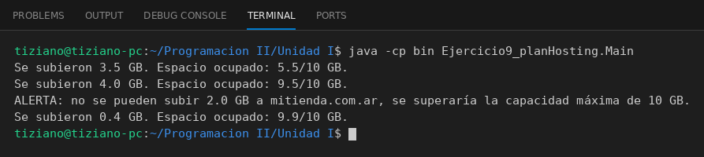

# PlanHosting

Programación II - Unidad 1 - Ejercicio 9

## Consigna
Representar una cuenta de hosting web y controlar el espacio de almacenamiento consumido, sin permitir superar la capacidad máxima.

## Lógica
- **Atributos (privados):** `nombreDominio` (String), `capacidadMaximaGB` (int) y `espacioOcupadoGB` (double).
- **Constructor:** valida que la capacidad sea mayor a cero y que el espacio ocupado esté entre 0 y la capacidad máxima (`IllegalArgumentException` si no).
- **`subirArchivos(double pesoGB)`:** rechaza pesos no positivos; si `espacioOcupadoGB + pesoGB` supera la capacidad, emite una alerta y no modifica nada; en caso contrario suma el peso al espacio ocupado.
- **`Main`:** crea un plan de 10 GB con 2 GB ocupados e intenta subir 3.5, 4.0, 2.0 y 0.4 GB: el de 2.0 GB dispara la alerta y el resto se suben.

## Ejecución

